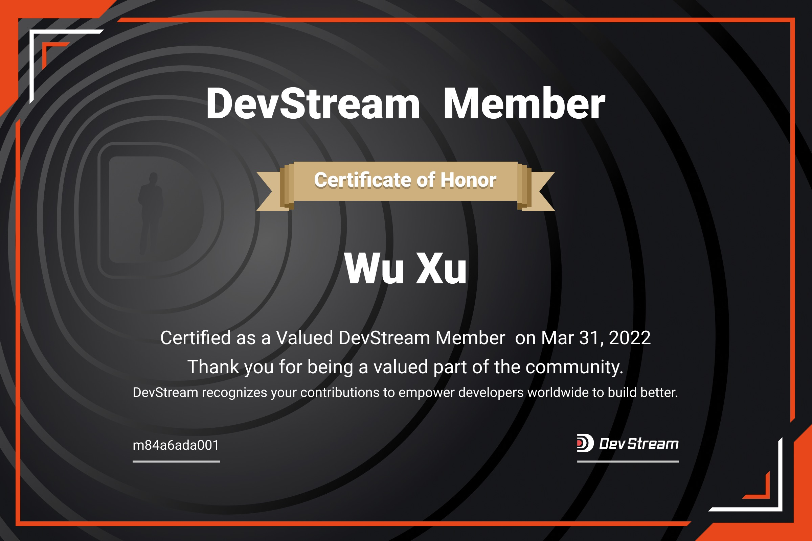



玉石公园-自行车



2022 年 3 月 DevStream 正式发布 v0.1 版本以来，在短短一个月内收获了数位贡献者！他们都在 DevStream 社区非常活跃，
以很高对积极性参与 bug 反馈、文档完善、技术布道、bugfix、feature 开发等等社区工作！这些全部都是我们非常认可的贡献方式！
所有的"认证"贡献者可以在 [Contributors](https://www.devstream.io/zh/blog/devstream-community-new-members/) 看到。

没错，在这短短一个月里已经有数位 Contributors 由于其贡献突出，我们决定邀请他们加入 DevStream GitHub Organization，成为 DevStream Member！

## 2022 年 3 月新晋 Member

经过 DevStream PMC 内部投票表决，我们决定邀请徐武、陈映初和余苏明和谢开天四位 Contributor 晋升为 Member！

---

### 徐武

---

### 陈映初

---

### 余苏明

---

### 谢开天

---

