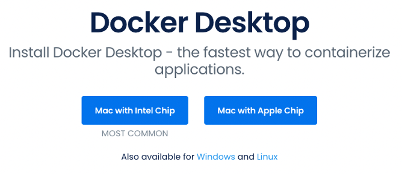
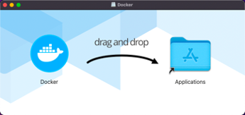
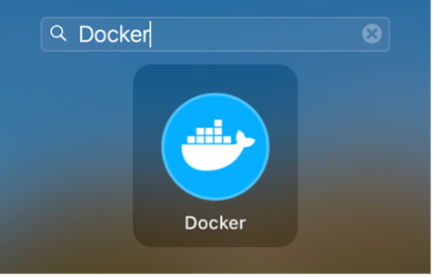


成都青龙湖弥远咖啡


---

# 从零开始快速搭建本地 Kubernetes 测试环节

从零开始？从零开始！

```go
var 零=99 // 别紧张，Just a jok。
```

Let's Get Started!

## 概述

“Kubernetes 集群部署”严格来说是一个复杂的技术活，有很多的可选方案。要交付一套靠拢“最佳实践”的高可用集群有很多需要考虑的技术细节。关于如何部署“真正高可用的 Kubernetes 集群”不在本文的讨论范围，所以今天我们的目标是使用一种简单的方式快速部署一个可用的 Kubernetes 环境。这套环境主要用于满足 DevStream 的开发测试需求。

快速部署 Kubernetes 有好几种可选方案，比如 Minikube 和 Kind。 Minikube最先基于虚拟化实现（新版本也支持容器化实现了），也就是通过 virtualbox 或者 kvm 等工具在本地创建若干虚拟机，然后在虚拟机中运行 Kubernetes 集群，一个节点也就对应一台虚拟机。Kind 通过容器化实现，也就是通过 Docker 在本地启动若干容器，每个容器充当 Kubernetes 的一个节点，在容器内再运行容器化应用。本文我们选择用 Kind 这种“容器中跑容器”的方式来搭建 Kubernetes 环境。当然如果大家有其他擅长的工具，也完全可以用，我们的目的仅仅是快速部署一套可用的 Kubernetes 集群环境。

本文以 macOS 作为开发环境，使用 Linux 或者 Windows 系统作为开发环境的同学可以参考本文的方法，相应地做一些灵活调整。

## Docker 的安装

在 Linux 下安装 Docker 是一件非常简单的事情，Docker 的核心原理就是基于 Linux 的 Namespace 和 Cgroup 等机制。不过在 macOS 和 Windows 下就需要通过虚拟化技术间接使用 Docker 了。当然我们现在已经不需要先安装虚拟化软件然后自己安装 Linux 虚拟机，再使用 Docker 了。我们可以直接在 docker.com 下载 Docker Desktop 来跑 Docker 程序。

我们在 https://www.docker.com/products/docker-desktop 寻找合适的 Docker Desktop 版本，主要是看清楚 cpu 架构是 Intel Chip 还是 Apple Chip，前者对应 amd64 架构版本 Mac，后者是 arm 架构的 M1 芯片版本 Mac。 下载页面大致如下：



下载完成后双击 Docker.dmg 文件，可以看到安装页面：



我们把 Docker 图标拖到 Applications 里，稍等不到半分钟，就可以在“启动台”里看到 Docker 图标了，然后点击“启动台”里的 Docker 打开 Docker Desktop：



稍等几秒钟，就可以看到启动页面了：


我们可以点击右上角的“齿轮⚙️”按钮来修改 Docker Desktop 的一些配置，比如调整 Docker 可以使用的资源等。如果后面我们需要启动的容器稍多一些，内存不够用了，可以回到这里来调整，比如我这里把 Memory 调大到 4.00 GB：


修改后记得点击右下角的“Apply & Restart”才会生效。

## Kind 介绍

Kind(Kubernetes-in-docker) 是一个使用 Docker 容器作为“节点”实现部署 Kubernetes 集群环境的工具。Kind 工具主要用于 Kubernetes 本身的测试，目前在很多需要部署到 Kubernetes 环境测试的项目在 ci 流程中都会选择用 Kind 来快速拉起一个 Kubernetes 环境，然后运行相关测试用例。

Kind 本身很简单，只包含一个简单的命令行工具“kind”和一个用来启动 Kubernetes 和 systemd等的 Docker 镜像。我们可以这样理解 Kind 的原理：它通过 Host 主机上的 Docker 使用封装了 Kubernetes 等工具的容器镜像拉起一个容器，这个容器里运行了 systemd，容器中的 systemd 进一步可以运行 Docker 和 Kubelet 等 Kubernetes 节点所需基础进程，然后这些进程就可以进一步运行 kube-apiserver、kube-controller-manager、kube-scheduler、kube-proxy、CoreDNS 等集群所需组件，从而一个这样的容器就组成了一个 Kubernetes 集群的“节点”。

所以 Kind 可以通过一个容器运行“单节点 Kubernetes 集群”，也可以进一步通过运行三个或更多容器实现在一台主机上运行一个“多节点Kubernetes 集群”。

## 一键搭建 Kind 测试环节

1. 下载 DevStream 项目主库：https://github.com/devstream-io/devstream
2. 在 devstream 目录内执行一条命令：`make e2e-up`

结束了？结束了。

发生了啥？大家可以打开 Makefile，在里面可以看到 e2e-up 其实是执行了 `sh hack/e2e/e2e-up.sh` 这个命令，在 e2e-up.sh 这个脚本中，我们完成了基于 Kind 的 Kubernetes 测试环境的搭建。

似乎行文至此，已经可以 AFK and have a cup of coffee 了！

但是好像没发挥尽兴。

好吧，那就详细掰扯掰扯 Kind 的玩法吧。

今天不用系安全带，我要严肃起来了。

## 使用 Kind “两键”搭建 Kubernetes 环境

现在我们来搭建 Kind 开发环境，在 GitHub 上可以看到 Kind最新的 Release 版本和对应的 Node 镜像：https://github.com/kubernetes-sigs/kind/releases

可以选择编译好的版本，也可以直接通过 go get 命令来下载编译 Kind。我们尽量选择较新的版本，然后通过下面命令下载安装（记得改成你需要的版本号）。

```sh
# 方式一：选择编译好的可执行文件
cd /tmp
curl -Lo ./kind https://github.com/kubernetes-sigs/kind/releases/download/v0.12.0/kind-darwin-arm64
chmod +x ./kind
sudo mv kind /usr/local/bin/

# 方式二：通过 go get 来下载编译
go get sigs.k8s.io/kind@v0.12.1
```

可以提前下载所需镜像，这里我们选择使用 1.22 版本的 Kubernetes 对应镜像：

```sh
kindest/node:v1.22.0@sha256:b8bda84bb3a190e6e028b1760d277454a72267a5454b57db34437c34a588d047
```

然后通过下面一条命令就可以快速拉起来一套 Kubernetes 环境：

```sh
kind create cluster --image=kindest/node:v1.22.0 --name=dev
```

上述执行输出大致如下：

```sh
Creating cluster "dev" ...
 ✓ Ensuring node image (kindest/node:v1.22.0) 🖼
 ✓ Preparing nodes 📦
 ✓ Writing configuration 📜
 ✓ Starting control-plane 🕹️
 ✓ Installing CNI 🔌
 ✓ Installing StorageClass 💾
Set kubectl context to "kind-dev"
You can now use your cluster with:

kubectl cluster-info --context kind-dev

Have a question, bug, or feature request? Let us know! https://kind.sigs.k8s.io/#community 🙂
```

按照命令行输出提示，接着我们需要执行 kubectl cluster-info --context kind-dev 来切换 context ，其实当前直接执行 kubectl get就可以看到新起来的 Kubernetes 环境了，多套集群的时候才需要这样切换。

```sh
$ kubectl get node
NAME                STATUS   ROLES                  AGE    VERSION
dev-control-plane   Ready    control-plane,master   7m4s   v1.22.0

$ kubectl get pod -n kube-system
NAME                                     READY    STATUS     RESTARTS      AGE
coredns-78fcd69978-hch75                  1/1     Running       0          10m
coredns-78fcd69978-ztqn4                  1/1     Running       0          10m
etcd-dev-control-plane                    1/1     Running       0          10m
kindnet-l8qxq                             1/1     Running       0          10m
kube-apiserver-dev-control-plane          1/1     Running       0          10m
kube-controller-manager-dev-control-plane 1/1     Running       0          10m
kube-proxy-mzfgc                          1/1     Running       0          10m
kube-scheduler-dev-control-plane          1/1     Running       0          10m
```

这样我们就快速收获了一个可以用来测试或者学习 Kubernetes 的环境了。

## 使用 Kind “三键”搭建多节点 Kubernetes 集群环境

最小的 Kubernetes HA 集群需要有 3 个 Master节点，当然我们也可以把 1 个节点的 all-in-one 环境称为“单节点集群”。这一小节我们接着看一下如何通过 Kind 来快速搭建多节点的 Kubernetes 集群环境。

### Kind 集群配置文件

Kind 环境搭建的时候可以自定义配置，通过 --config 来指定自定义配置文件路径。Kind 支持的配置格式如下：

```yaml
# this config file contains all config fields with comments
# NOTE: this is not a particularly useful config file
kind: Cluster
apiVersion: kind.x-k8s.io/v1alpha4
# patch the generated kubeadm config with some extra settings
kubeadmConfigPatches:
- |
  apiVersion: kubelet.config.k8s.io/v1beta1
  kind: KubeletConfiguration
  evictionHard:
    nodefs.available: "0%"
# patch it further using a JSON 6902 patch
kubeadmConfigPatchesJSON6902:
- group: kubeadm.k8s.io
  version: v1beta2
  kind: ClusterConfiguration
  patch: |
    - op: add
      path: /apiServer/certSANs/-
      value: my-hostname
# 1 control plane node and 3 workers
nodes:
# the control plane node config
- role: control-plane
# the three workers
- role: worker
- role: worker
- role: worker
```

可以看到这里的配置项分为两个部分，上面是和 Kubeadm 如何配置 Kubernetes 相关的配置项，下面是和 Nodes 角色和规模相关的配置项。不难猜到，我们需要部署多个节点的 Kubernetes 集群，可以通过指定 nodes 部分配置的方式来实现。

### 一主三从集群搭建

我们准备一份对应的配置文件，命名为multi-node-config.yaml，内容如下：

```yaml
kind: Cluster
apiVersion: kind.x-k8s.io/v1alpha4
nodes:
- role: control-plane
- role: worker
- role: worker
- role: worker
```

接着执行如下命令拉起集群：

```sh
$ kind create cluster --config multi-node-config.yaml \
 --image=kindest/node:v1.22.0 --name=dev4
```

等待命令执行结束，我们可以看到类似前面单节点环境搭建时看到的输出结果，有个主要区别是步骤多了一个“Joining worker nodes”：

```sh
Creating cluster "dev4" ...
 ✓ Ensuring node image (kindest/node:v1.22.0) 🖼
 ✓ Preparing nodes 📦 📦 📦 📦
 ✓ Writing configuration 📜
 ✓ Starting control-plane 🕹️
 ✓ Installing CNI 🔌
 ✓ Installing StorageClass 💾
 ✓ Joining worker nodes 🚜
Set kubectl context to "kind-dev4"
You can now use your cluster with:

kubectl cluster-info --context kind-dev4

Thanks for using kind! 😊
```

可以通过如下命令查看新创建的集群：

```sh
$ kubectl cluster-info --context kind-dev4
Kubernetes control plane is running at https://127.0.0.1:51851
CoreDNS is running at https://127.0.0.1:51851/api/v1/namespaces/kube-system/services/kube-dns:dns/proxy

To further debug and diagnose cluster problems, use 'kubectl cluster-info dump'.
$ kubectl get node
NAME                 STATUS   ROLES                  AGE     VERSION
dev4-control-plane Ready   control-plane,master 3m28s   v1.22.0
dev4-worker          Ready    <none>                 2m54s   v1.22.0
dev4-worker2         Ready    <none>                 2m54s   v1.22.0
dev4-worker3         Ready    <none>                 2m54s   v1.22.0
```

上述命令执行结果可以很清晰看到这个 dev4 集群有1个 Master 节点和 3 个 Worker 节点。

### 三主三从 HA 集群搭建

当然我们这里的 HA 只是表示 Master 节点组件会运行 3 副本，一定程度上实现 Master 节点没有单点故障，并不是严格意义上的“高可用”。

同样准备一份配置文件 ha-config.yaml，内容如下：

```yaml
kind: Cluster
apiVersion: kind.x-k8s.io/v1alpha4
nodes:
- role: control-plane
- role: control-plane
- role: control-plane
- role: worker
- role: worker
- role: worker
```

接着执行如下命令拉起集群：

```sh
$ kind create cluster --config ha-config.yaml \
 --image=kindest/node:v1.22.0 --name=dev6
```

等待命令执行结束，我们依旧可以看到熟悉的日志输出结果，和上面稍有不同，这里主要是多了“Configuring the external load balancer”和“Joining more control-plane nodes”：

```sh
Creating cluster "dev6" ...
 ✓ Ensuring node image (kindest/node:v1.22.0) 🖼
 ✓ Preparing nodes 📦 📦 📦 📦 📦 📦
 ✓ Configuring the external load balancer ⚖️
 ✓ Writing configuration 📜
 ✓ Starting control-plane 🕹️
 ✓ Installing CNI 🔌
 ✓ Installing StorageClass 💾
 ✓ Joining more control-plane nodes 🎮
 ✓ Joining worker nodes 🚜
Set kubectl context to "kind-dev6"
You can now use your cluster with:

kubectl cluster-info --context kind-dev6

Have a nice day! 👋
```

这里也可以看到几个很有趣的细节，比如“Preparing nodes”步骤后面小盒子数量和节点数是相等的；另外最后一句问候语也不是固定的。比如前面是“Thanks for using kind! 😊”，这里又变成了“Have a nice day! 👋”，可见 Kind背后的开发者是一群“可爱”又“有趣”的工程师！

同样我们通过几个命令看一下刚才创建的集群：

```sh
$ kubectl cluster-info --context kind-dev6
Kubernetes control plane is running at https://127.0.0.1:52937
CoreDNS is running at https://127.0.0.1:52937/api/v1/namespaces/kube-system/services/kube-dns:dns/proxy

To further debug and diagnose cluster problems, use 'kubectl cluster-info dump'.
$ kubectl get node
NAME                  STATUS   ROLES                  AGE     VERSION
dev6-control-plane    Ready    control-plane,master   8m19s   v1.22.0
dev6-control-plane2   Ready    control-plane,master   7m46s   v1.22.0
dev6-control-plane3   Ready    control-plane,master   7m20s   v1.22.0
dev6-worker           Ready    <none>                 7m      v1.22.0
dev6-worker2          Ready    <none>                 7m      v1.22.0
dev6-worker3          Ready    <none>                 7m      v1.22.0
```

上述命令执行结果可以很清晰看到这个 dev6 集群有3个 Master 节点和 3 个 Worker 节点。

到这里我们就掌握了通过 Kind 来非常轻松地搭建多节点的 Kubernetes 集群环境，后面大家可以根据自己的需要来选择节点规模和角色，搭建合适的测试环境。


## Kind 用法进阶

通过前面几节的学习，我们已经掌握了用 Kind 搭建各种类型的集群。但是要用好这些集群，还需要掌握一些运维技巧，本小节我们来学习一下 Kind 集群的的一些进阶操作。

### 端口映射

设想一种场景：我们在 Kind 集群中运行一个 Nginx 容器服务，监听 80 端口对外暴露，这时候在另外一台机器上能不能访问到 Kind 集群所在机器的 80 端口进而访问到这个 Nginx 服务呢？其实不行，这两个 80 端口明显不在一个网络命名空间。我们可以通过如下方式来配置端口映射，解决这类问题。

在配置文件中增加 extraPortMappings 配置项：

```yaml
kind: Cluster
apiVersion: kind.x-k8s.io/v1alpha4
nodes:
- role: control-plane
  extraPortMappings:
  - containerPort: 80
    hostPort: 80
    listenAddress: "0.0.0.0"
    protocol: tcp
```

这样我们搭建出来到 Kubernetes 集群中使用 NodePort 暴露的 80 端口或者是 hostNetwork 方式暴露 80 端口的 Pod 就可以通过主机的 80 端口来访问到了。

### 暴露 kube-apiserver

有时候我们会在一台机子上使用 Kind 搭建一套 Kubernetes 环境，在另外一台机器上写代码，这时候会发现我们无法连接到 Kind 集群中的 kube-apiserver 来调试程序。其实是因为默认配置下 kube-apiserver 监听 127.0.0.1 加随机端口，我们要从外部访问就需要把 kube-apiserver 监听的网卡改成非 lo 的对外网卡，比如 eth0。

同样我们通过配置文件自定义来实现，添加 networking.apiServerAddress 配置项，值是本地网卡 ip，根据实际情况修改：

```yaml
kind: Cluster
apiVersion: kind.x-k8s.io/v1alpha4
networking:
  apiServerAddress: "192.168.39.1"
```

### 启用 Feature Gates

如果我们要使用一些 alpha 阶段的特性，就需要通过配置 Feature Gates 来实现了。在使用 kubeadm 搭建环境的时候，是可以通过配置 ClusterConfiguration 来实现这个需求的，kubeadm 被 Kind 封装后，我们在 Kind 里如何启用 Feature Gates 呢？

方案如下，FeatureGateName 就是我们需要启用的 Feature Gate 名字：

```yaml
kind: Cluster
apiVersion: kind.x-k8s.io/v1alpha4
featureGates:
  FeatureGateName: true
```

### 导入镜像

通过 kind 搭建的环境本质是运行在一个容器内，宿主机上的镜像默认不能被 Kind 环境所识别到，这时我们可以通过如下方式导入镜像：

```sh
# 假如需要的镜像是 my-image:v1
kind load docker-image my-image:v1 --name dev
# 假如需要的镜像是一个 tar 包 my-image.tar
kind load image-archive my-image.tar --name dev
```

知道了这个方法后，我们构建一个新镜像需要放到 Kind 环境里运行，就可以通过类似如下步骤来实现了：

```sh
docker build -t my-image:v1 ./my-image-dir
kind load docker-image my-image:v1
kubectl apply -f my-image.yaml
```

怎么查看当前 Kind 环境里有哪些镜像呢？也很简单，可以这样：

```sh
docker exec -it dev-control-plane crictl images
```

其中 dev-control-plane 是 node 容器名，有多套环境时这个名字需要对应灵活切换。另外可以通过 crictl -h 查看 crictl 所支持的其他命令，比如 crictl rmi <image_name> 可以用于删除镜像等。
